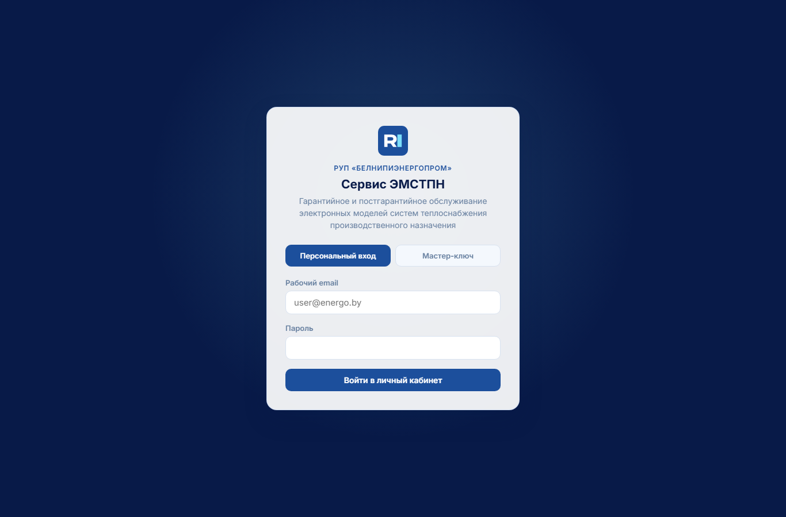
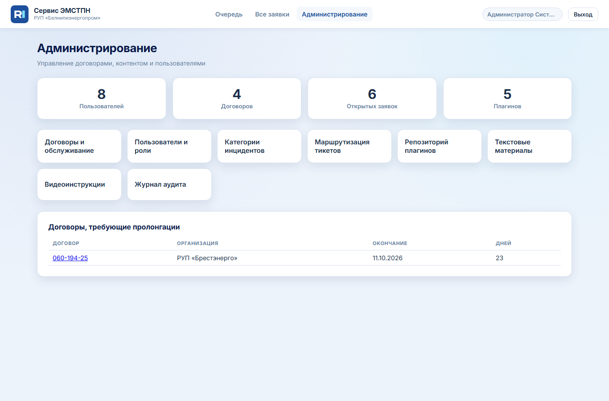
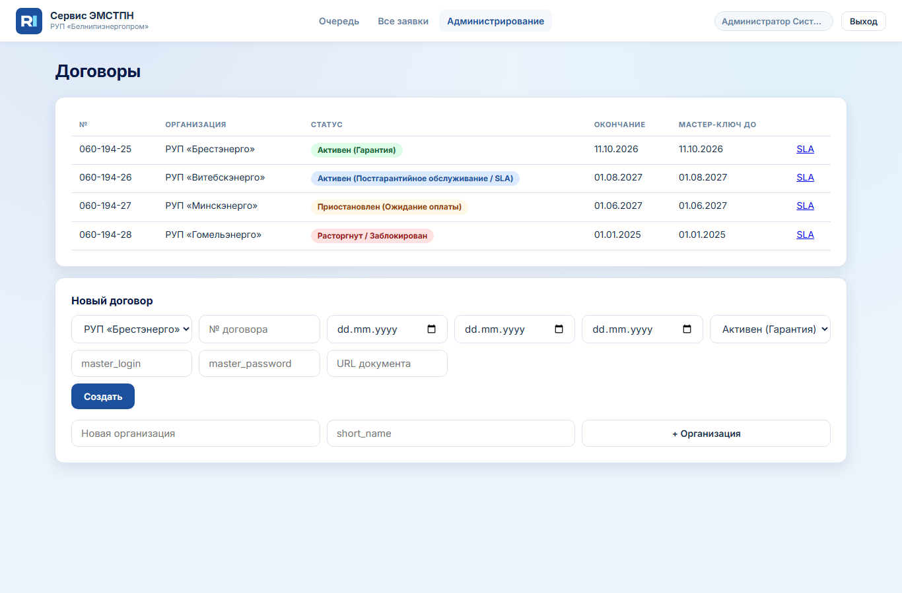
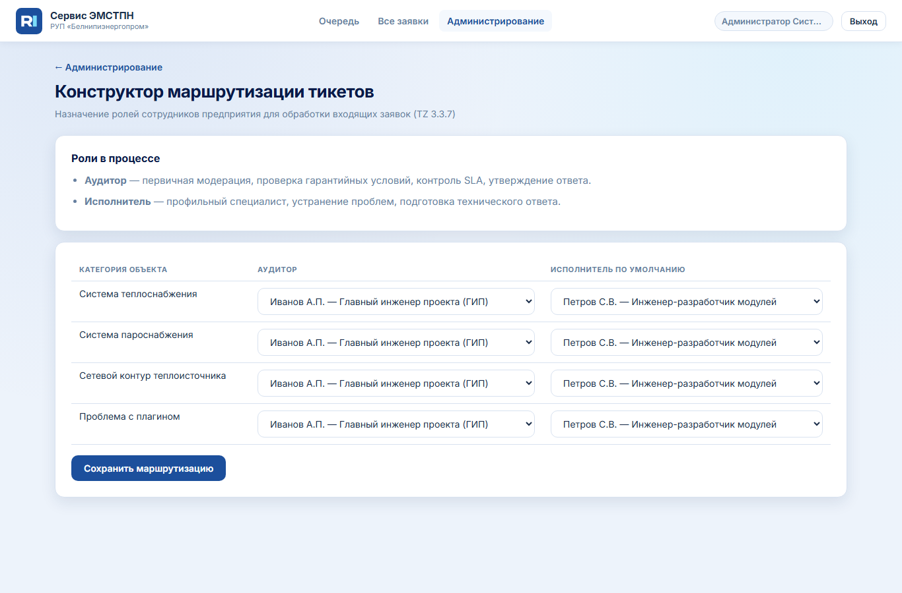
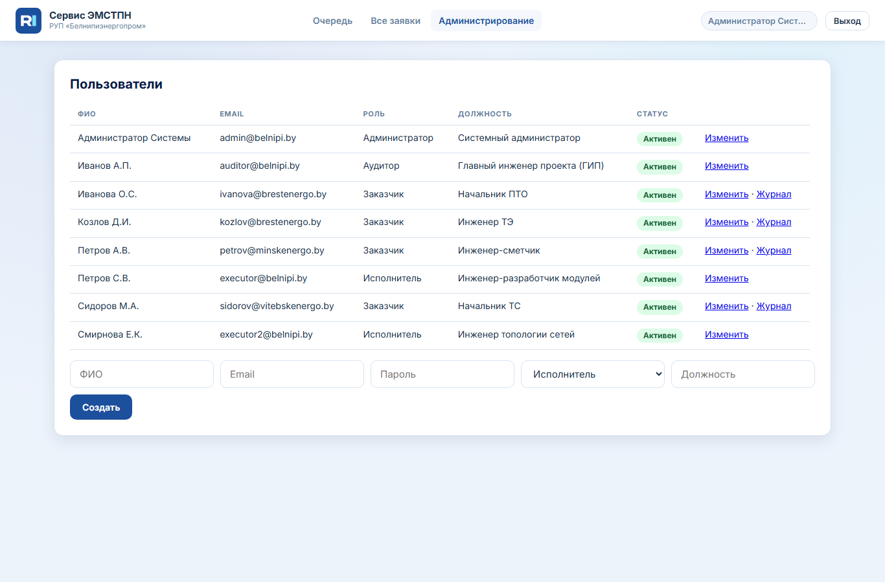
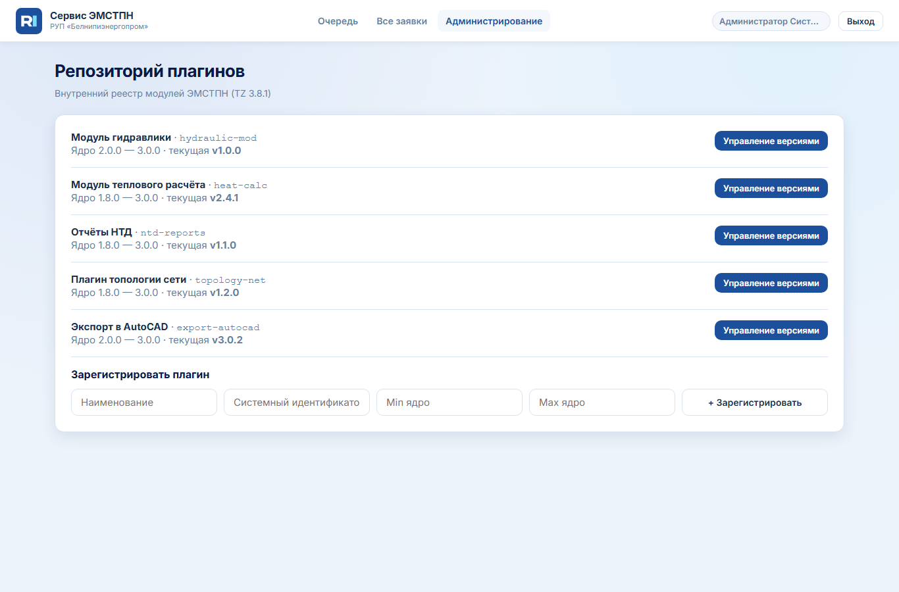
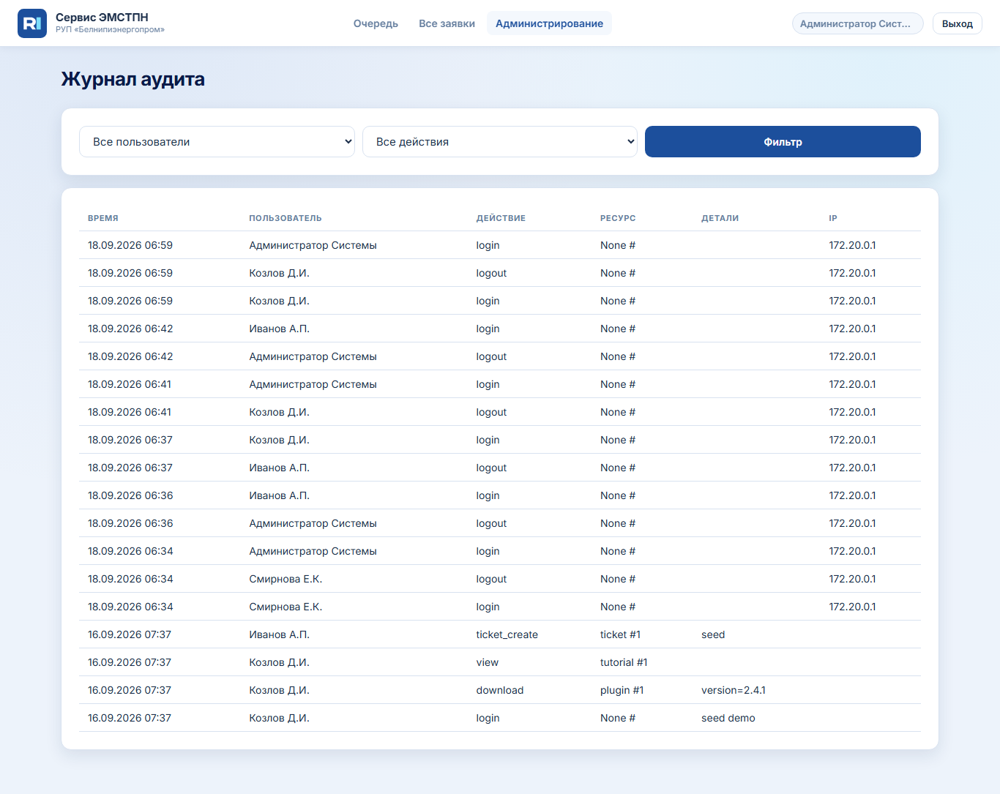
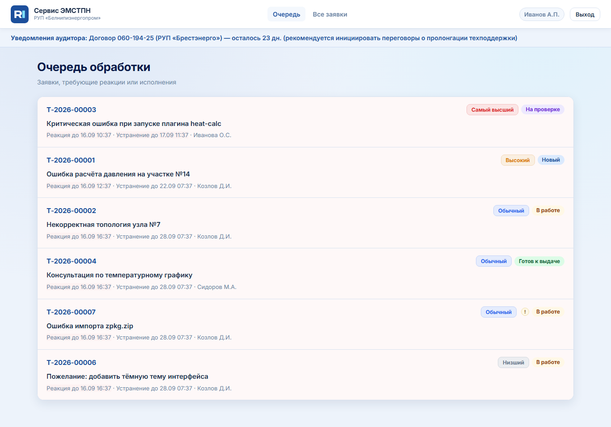

# Инструкция администратора, аудитора и исполнителя

Платформа **Сервис ЭМСТПН** — администрирование договоров, контента, пользователей и обработка заявок.

**Вход администратора (тест):** `admin@belnipi.by` / `admin123`  
**Аудитор (ГИП):** `auditor@belnipi.by` / `auditor123`  
**Исполнитель:** `executor@belnipi.by` / `executor123`

---

## 1. Роли и зона ответственности

| Роль | Что делает | Почему отделено |
|------|------------|-----------------|
| **Администратор** | Договоры, SLA, видимость контента, CMS, пользователи, журнал | Централизованное управление доступом |
| **Аудитор (ГИП)** | Первичная модерация, назначение исполнителя, приоритет, утверждение ответа | Контроль гарантийных условий и SLA |
| **Исполнитель** | Технический ответ, файлы, передача на проверку; **создание и правка туториалов и видео** (меню «Контент») | Профильная экспертиза и база знаний |
| **Заказчик** | ЛК, заявки (см. [инструкцию пользователя](INSTRUKCIYA_POLZOVATELA.md)) | — |

---

## 2. Вход в систему

Тот же экран, что у заказчика — вкладка **«Персональный вход»**.



После входа у staff в меню: **Очередь**, **Все заявки**, у admin дополнительно **Администрирование**.

---

## 3. Панель администратора

**Администрирование** → `/admin/`



| Плитка | Назначение |
|--------|------------|
| Договоры и обслуживание | Сроки, статусы, мастер-ключи, видимость контента |
| Пользователи и роли | Учётки staff и просмотр аудита заказчиков |
| Категории инцидентов | Справочник для формы заявки |
| Маршрутизация тикетов | Аудитор и исполнитель по категории объекта |
| Репозиторий плагинов | Версии, загрузка, откат |
| Текстовые / видео материалы | CMS базы знаний |
| Журнал аудита | Неизменяемый лог действий |

Блок **«Договоры, требующие пролонгации»** — договоры с истекающим сроком (уведомление аудиторам в шапке).

---

## 4. Договоры и SLA

**Договоры и обслуживание**



### 4.1. Статусы договора (зачем каждый)

| Статус | Поведение для заказчика |
|--------|-------------------------|
| Активен (Гарантия) | Полный доступ по ТЗ |
| Активен (Постгарантийное / SLA) | Плагины, материалы, заявки в рамках SLA |
| Приостановлен | Только чтение: старые заявки, без новых и без скачивания плагинов |
| Расторгнут / Заблокирован | Вход заблокирован |

**Почему важно:** статус напрямую влияет на бизнес-риски и оплату; изменение даты окончания **продлевает доступ** всем пользователям договора автоматически.

### 4.2. Карточка договора

- **Дата окончания обслуживания** — календарь; при пролонгации обновите вручную.
- **Мастер-ключ** — для первичной регистрации сотрудников организации.
- **Видимость контента** — галочки плагинов, туториалов, видео; скрытое **не отображается** в ЛК (фильтрация на сервере).
- Кнопка **«Применить ко всем договорам организации»** — копирование матрицы доступа.

---

## 5. Маршрутизация заявок



**Зачем:** по категории объекта (теплоснабжение, плагин и т.д.) система знает, **какой аудитор** и **какой исполнитель по умолчанию** получают новую заявку.

**Как:** для каждой строки справочника выберите аудитора и (опционально) исполнителя → **Сохранить маршрутизацию**.

**Почему:** без маршрутизации заявки не попадут в понятную очередь ответственным.

---

## 6. Пользователи



- Создание учётных записей **staff** (админ, аудитор, исполнитель).
- Редактирование роли, блокировка.
- **Журнал** у заказчика — скачивания, просмотры, заявки (аудит по 99-З и внутреннему регламенту).

Заказчики регистрируются сами через мастер-ключ; admin не создаёт их массово, кроме тестов.

---

## 7. Репозиторий плагинов



1. **Зарегистрировать плагин** — имя, slug, совместимость с ядром.
2. **Управление версиями** — загрузка ZIP, changelog (Markdown), текущая/архивная версия, откат.

**Зачем changelog:** заказчик видит «что нового» перед обновлением.  
**Зачем min/max ядра:** предотвращение установки на неподдерживаемую версию ЭМСТПН.

---

## 8. Текстовые материалы и видео

- **Туториалы** — Markdown в БД, полнотextовый поиск, API для будущего RAG/LLM.
- **Видео** — URL embed или загрузка файла; **таблица тайм-кодов** с описаниями глав (для навигации ИИ и пользователя).

Публикация: флаг «Опубликован» + привязка к договору в карточке договора.

---

## 9. Журнал аудита



- Фиксируются входы, скачивания, создание заявок, действия staff.
- Записи **нельзя изменить или удалить** (триггеры PostgreSQL).

**Зачем:** расследование инцидентов ИБ и доказательство соблюдения регламента.

---

## 10. Работа аудитора и исполнителя с заявками

### 10.1. Очередь

**Очередь** → `/tickets/staff`



Карточки с приоритетом, SLA (реакция / устранение), автором. Просрочки подсвечиваются.

### 10.2. Карточка заявки

Вкладки: **Суть проблемы**, **История изменений**, **Форма ответа** (staff).

**Аудитор:**

1. **Назначить исполнителя** — выпадающий список + поиск по ФИО → «Назначить и перевести в работе».
2. **Переквалификация критичности** — только с **обязательной причиной** (требование ТЗ).
3. **Управление статусом** — «Готов к выдаче» / «Отклонено».
4. **Утвердить и отправить заказчику** — финальный ответ.

**Исполнитель:**

1. Заполнить **официальный текст ответа** (Markdown).
2. Приложить исправленные файлы (chunk upload, большие архивы).
3. **Передать на проверку аудитору**.

### 10.3. Таймеры T1 / T2

| Таймер | Фаза |
|--------|------|
| T1 | Реакция аудитора |
| T2 | Работа исполнителя |

При смене статусов таймеры останавливаются/запускаются автоматически; в статусе **Решено** заказчик видит итоговые значения.

---

## 11. REST API (для интеграций)

- Документация: `/api/v1/docs` и `/api/v1/docs/ui`
- База знаний и видео — для индексации LLM/RAG
- ACL: заказчик видит только свои заявки; service key — для служебной индексации

---

## 12. Эксплуатация (кратко)

| Задача | Команда / файл |
|--------|----------------|
| Запуск | `docker compose up -d --build` |
| Демо-данные | `docker compose --profile seed run --rm seed` |
| Дамп БД | `database/servicesystem_seed.sql` |
| Резервное копирование | `docker compose --profile backup up -d` |
| HTTPS в production | reverse-proxy + `FORCE_HTTPS=1` |

---

## 13. Обновление скриншотов в инструкции

```bash
docker compose up -d
python scripts/capture_docs_screenshots.py
```

Файлы сохраняются в `docs/screenshots/`.
