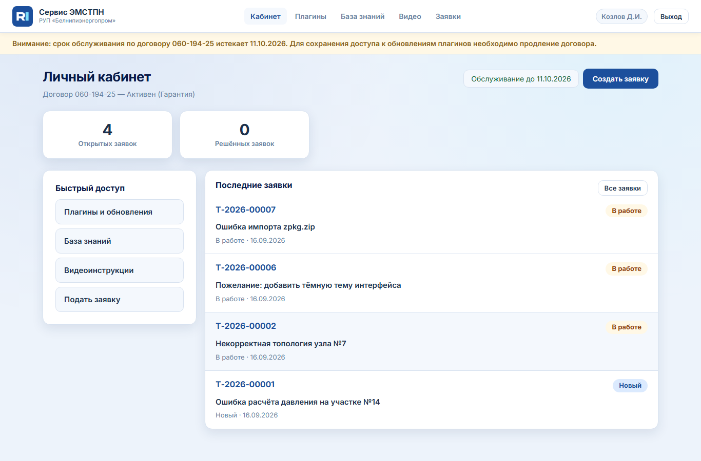
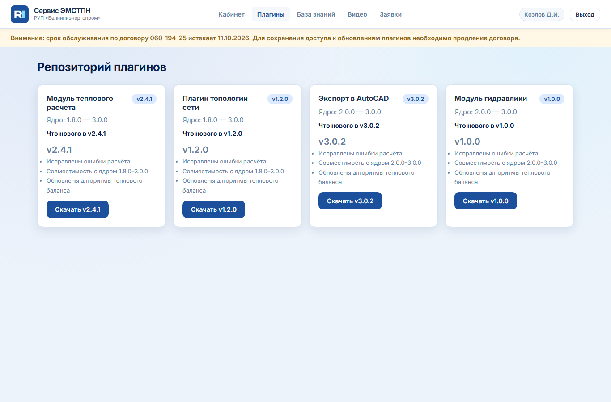
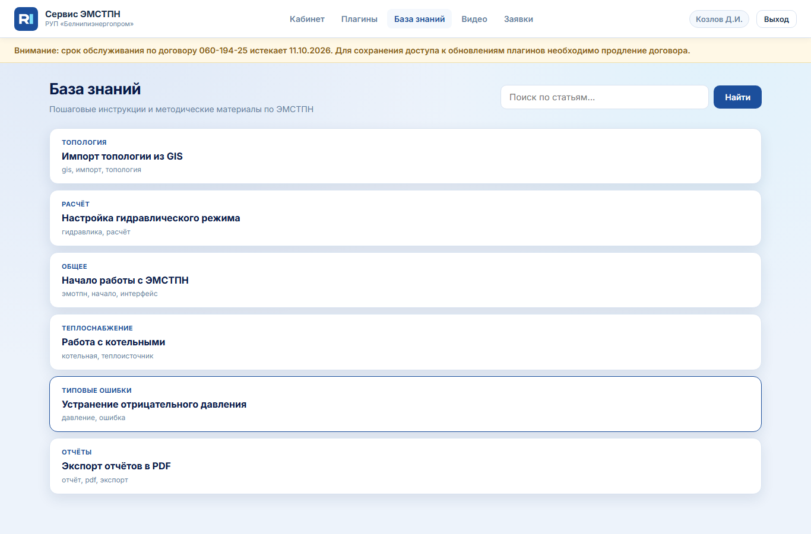
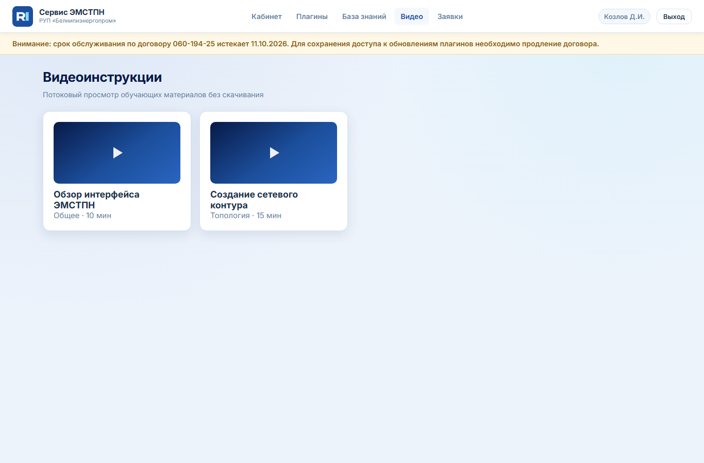
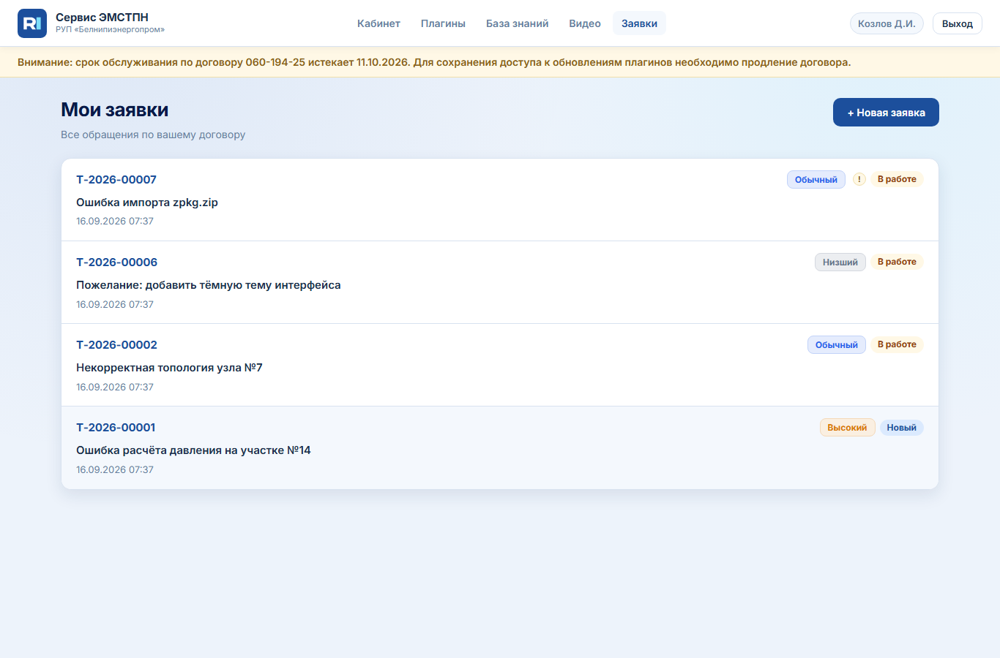
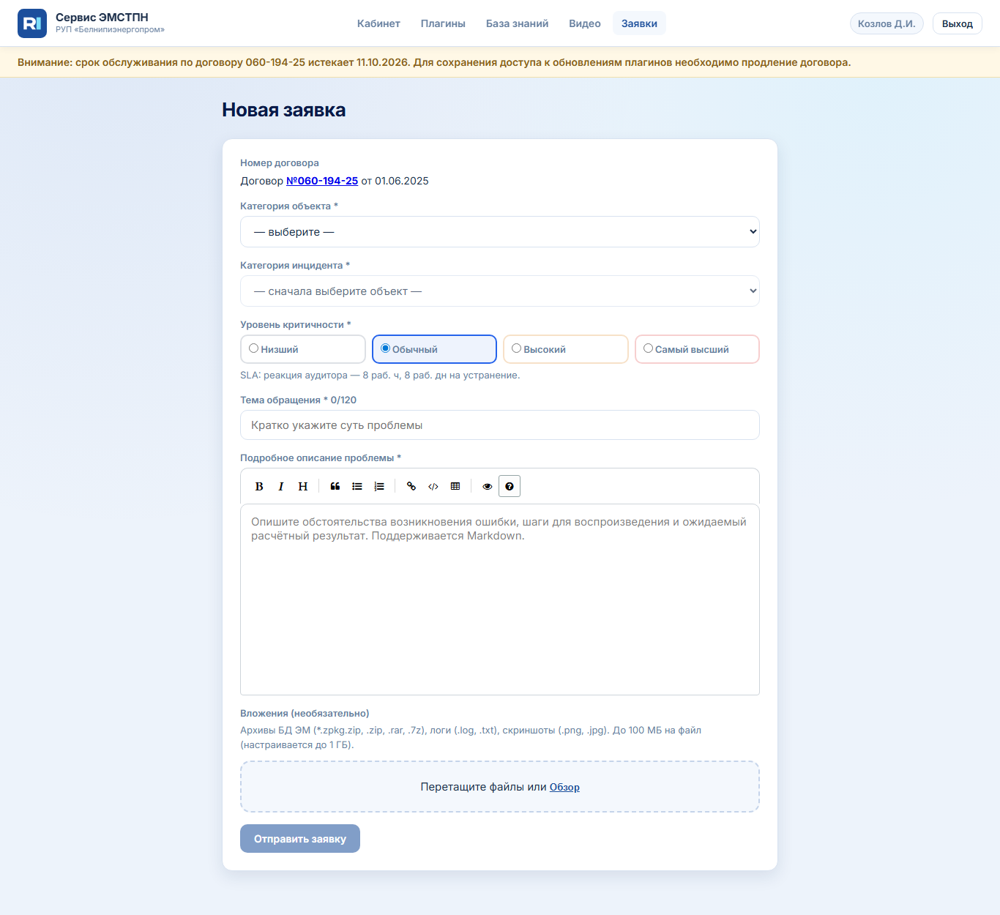

# Инструкция пользователя (заказчик)

Система гарантийного и постгарантийного обслуживания **ЭМСТПН** для сотрудников организаций-заказчиков (РУП-облэнерго).

**Адрес:** http://localhost:8095 (на стенде заказчика — URL, выданный администратором)

---

## 1. Зачем нужна система

| Задача | Где в системе |
|--------|----------------|
| Скачать актуальные плагины к ЭМСТПН | **Плагины** |
| Прочитать инструкции и методички | **База знаний** |
| Посмотреть обучающие видео | **Видео** |
| Сообщить об ошибке или запросить помощь | **Заявки** |

Доступ к материалам и функциям определяется **договором** вашей организации: часть контента может быть скрыта, при приостановке договора — только просмотр старых заявок.

---

## 2. Первый вход и регистрация

### 2.1. Мастер-ключ (один раз на организацию)

**Зачем:** по ТЗ сначала организация получает временный ключ, затем каждый сотрудник регистрируется персонально.

1. Откройте страницу входа.
2. Вкладка **«Мастер-ключ»**.
3. Введите логин и пароль, выданные администратором (на тестовом стенде для Бреста: `master_brest` / `MasterBrest2026!`).
4. Заполните форму регистрации: ФИО, должность, email, телефон, пароль.
5. Подтвердите согласие на обработку персональных данных.

**Почему так:** персональный аккаунт наследует права договора организации; все действия фиксируются в журнале аудита.

### 2.2. Персональный вход (ежедневная работа)

1. Вкладка **«Персональный вход»**.
2. Рабочий email и пароль, заданные при регистрации.

**Тестовый заказчик:** `kozlov@brestenergo.by` / `customer123`

---

## 3. Личный кабинет

**Меню → Кабинет** или `/cabinet/`

| Элемент | Что это | Зачем |
|---------|---------|--------|
| Счётчики открытых / решённых заявок | Сводка по вашим обращениям | Быстро оценить нагрузку |
| **Создать заявку** (справа в шапке) | Переход к форме новой заявки | Основное действие при инциденте |
| Быстрый доступ | Ссылки на разделы | Навигация без меню |
| Последние заявки | Карточки недавних тикетов | Открыть заявку в один клик |

**Баннер жёлтого цвета** вверху страницы — напоминание, что срок договора скоро истекает; для продления обращайтесь к администратору Белнипи.

---

## 4. Плагины

**Меню → Плагины**

- **Что:** дистрибутивы модулей (расчёт, топология, экспорт и т.д.).
- **Как:** нажмите **«Скачать»** у нужной версии; перед установкой прочитайте changelog (что изменилось).
- **Почему:** версии согласованы с диапазоном ядра ЭМСТПН (`Min`–`Max` на карточке); несовместимая версия может вызвать сбой.
- **Зачем контроль доступа:** плагины — критичные объекты; вы видите только то, что разрешено вашему договору.

При статусе договора **«Приостановлен»** скачивание недоступно.

---

## 5. База знаний

**Меню → База знаний**

- **Что:** текстовые инструкции (Markdown), поиск по статьям.
- **Как:** введите запрос в поле поиска справа от заголовка → **«Найти»**; откройте статью из списка.
- **Зачем:** снизить число типовых заявок — многие вопросы решаются без обращения в поддержку.

---

## 6. Видеоинструкции

**Меню → Видео**

- **Что:** потоковый просмотр (без скачивания файла на диск, если настроен embed).
- **Как:** выберите ролик; внутри — оглавление с тайм-кодами.
- **Зачем:** наглядное обучение для новых инженеров.

---

## 7. Заявки (тикеты)

### 7.1. Список заявок

**Меню → Заявки**

Каждая строка — карточка:

- номер и **статус** (бейдж);
- тема;
- дата создания или срок обработки для решённых.

Нажмите на карточку — откроется детальная страница с историей и официальным ответом (после решения).

### 7.2. Создание заявки

**Создать заявку** в шапке или **+ Новая заявка**

| Поле | Зачем важно |
|------|-------------|
| Категория объекта / инцидента | Маршрутизация к нужному специалисту Белнипи |
| Уровень критичности | Запускает **SLA** (срок реакции аудитора и устранения) |
| Тема (до 120 символов) | Кратко для очереди |
| Описание (Markdown) | Шаги воспроизведения, ожидаемый результат расчёта |
| Вложения | Архивы `.zpkg`, `.zip`, PDF, логи, скриншоты — до лимита на файл |

**Почему SLA:** гарантийные обязательства фиксируют регламентные сроки; приоритет может быть пересмотрен **только аудитором** с указанием причины.

После отправки заявка получает номер вида **Т-2026-00001**.

### 7.3. Статусы заявки (что видит заказчик)

| Статус | Смысл |
|--------|--------|
| Новый | Принята, ожидает реакции аудитора |
| В работе | Назначен исполнитель |
| На проверке | Ответ готовится/проверяется аудитором |
| Готов к выдаче | Финальное согласование |
| Решено | Официальный ответ и файлы в карточке |
| Отклонено | Не гарантийный случай (с пояснением) |

---

## 8. Частые вопросы

**Не вижу плагин / статью / видео**  
Администратор ограничил видимость для вашего договора. Обратитесь к куратору в Белнипи.

**Не могу создать заявку**  
Договор в статусе «Приостановлен» или «Расторгнут» — только просмотр.

**Забыл пароль**  
Обратитесь к администратору системы для сброса.

---

## 9. Контакты и поддержка

Техническая поддержка по договору — через **заявки** в системе.  
Организация: **РУП «Белнипиэнергопром»**.
